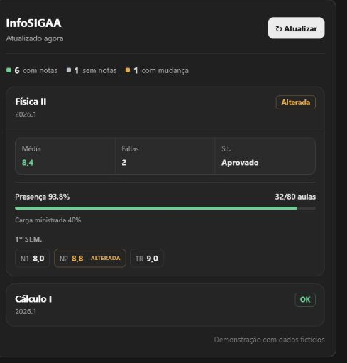

# InfoSIGAA



Extensão para Chrome que organiza notas, médias, faltas, frequência e mudanças recentes do SIGAA do IFFarroupilha em um painel local no navegador.

[](https://github.com/pedroSalles08/InfoSIGAA/releases/latest)
[](https://github.com/pedroSalles08/InfoSIGAA/actions/workflows/pages.yml)
[](LICENSE)
[](https://pedrosalles08.github.io/InfoSIGAA/instalacao/)
[](manifest.json)

> **Aviso de não afiliação:** o InfoSIGAA é um projeto independente, sem vínculo oficial com o SIGAA ou com o Instituto Federal Farroupilha. SIGAA e IFFarroupilha pertencem aos seus respectivos responsáveis.

**[Instalar o InfoSIGAA](https://pedrosalles08.github.io/InfoSIGAA/instalacao/)** · [Acessar o site](https://pedrosalles08.github.io/InfoSIGAA/) · [Política de privacidade](https://pedrosalles08.github.io/InfoSIGAA/privacidade/) · [Suporte](https://pedrosalles08.github.io/InfoSIGAA/suporte/)

## Navegação

- [Instalação e uso](#instalação-para-usuários)
- [Limitações conhecidas](#limitações-conhecidas) e [privacidade](#privacidade)
- [Arquitetura e tecnologias](#arquitetura-resumida)
- [Desenvolvimento e testes](#desenvolvimento-e-testes)
- [Empacotamento e Releases](#empacotamento-e-releases)

## Instalação para usuários

O Google Chrome é o único navegador oficialmente suportado no momento. A instalação é manual e requer uma sessão já autenticada no SIGAA do IFFarroupilha.

1. Acesse o **[guia oficial de instalação](https://pedrosalles08.github.io/InfoSIGAA/instalacao/)** e baixe o pacote ZIP preparado da versão atual.
2. Extraia o pacote em uma pasta permanente.
3. Abra `chrome://extensions`, ative o modo do desenvolvedor e escolha **Carregar sem compactação**.
4. Selecione a pasta extraída que contém o `manifest.json`.
5. Entre no SIGAA, abra o Portal do Discente e clique em **Atualizar** no painel do InfoSIGAA.

Não mova nem exclua a pasta enquanto a extensão estiver instalada. As atualizações também são manuais; o guia permanente explica como substituir os arquivos e recarregar a extensão sem criar outra instalação. Para usuários, o pacote correto é o indicado nessa página — não os arquivos automáticos “Source code” do GitHub.

## Funcionalidades e comportamento

- Usa a sessão do SIGAA que já está aberta no navegador; o login continua sendo feito diretamente no sistema da instituição.
- Lê as matérias do período e organiza notas e resumos por matéria.
- Exibe médias, faltas e frequência quando essas informações estão disponíveis nas páginas consultadas.
- Oferece busca, filtros e detalhes expansíveis no popup.
- Mantém o último resultado válido em `chrome.storage.local` e compara cada atualização com o snapshot anterior.
- Destaca notas novas, alteradas ou removidas em relação ao snapshot anterior.
- Em caso de sessão expirada ou falha total da atualização, mantém o último snapshot válido e orienta o usuário a entrar novamente.
- Se uma matéria falhar, registra o erro apenas nela e mantém o resultado das demais.
- Quando a aba ativa já contém uma tabela de notas, atualiza aquela matéria e preserva as outras no snapshot local.

### O que a extensão não faz

- Não faz login automaticamente nem solicita ou armazena senha.
- Não salva cookies manualmente.
- Não envia notas para um servidor próprio do projeto.
- Não executa verificações automáticas em segundo plano.
- Não envia notificações do sistema operacional.

## Limitações conhecidas

- O suporte oficial atual é restrito ao Google Chrome. Edge, Brave e Opera podem aceitar o pacote por usarem Chromium, mas não foram homologados; o pacote atual não é compatível com Firefox.
- O usuário precisa entrar manualmente no SIGAA antes de atualizar o painel.
- Instalação e atualizações são manuais enquanto o InfoSIGAA não está disponível em uma loja oficial.
- O escopo atual é o SIGAA do IFFarroupilha, conforme o domínio permitido no manifesto.
- A leitura depende da estrutura atual das páginas JSF/RichFaces. Mudanças no SIGAA podem exigir ajustes no parser e no fluxo de navegação.

## Privacidade

O InfoSIGAA usa somente a sessão já aberta no navegador. Os dados processados e o último painel válido ficam no armazenamento local da extensão; o projeto não possui backend para armazenar notas.

Em computadores compartilhados, outra pessoa com acesso ao mesmo perfil do Chrome pode visualizar o painel salvo. Prefira um perfil individual e consulte a **[política de privacidade completa](https://pedrosalles08.github.io/InfoSIGAA/privacidade/)** para conhecer as permissões e os cuidados recomendados.

## Arquitetura resumida

O fluxo principal usa apenas os módulos incluídos pelo manifesto e pelo pacote de distribuição:

1. O usuário entra no SIGAA e abre uma página do sistema.
2. O popup lê a página ativa com `chrome.tabs` e `chrome.scripting` quando **Atualizar** é acionado.
3. O service worker recebe o pedido e coordena a atualização.
4. O módulo de busca navega pelas páginas necessárias usando a sessão existente.
5. O parser transforma formulários e HTML do SIGAA em matérias, notas, resumos e frequência.
6. O resultado é comparado com o snapshot anterior.
7. O novo estado válido é salvo em `chrome.storage.local` e renderizado no popup.

| Caminho | Responsabilidade |
| --- | --- |
| `manifest.json` | Declara o popup, o service worker, as permissões e o domínio autorizado. |
| `popup.html`, `popup.css`, `popup.js` | Estrutura, apresentação e interação do painel. |
| `src/background.js` | Recebe a solicitação do popup e coordena a busca no service worker. |
| `src/sigaa-fetcher.js` | Faz as requisições autenticadas, percorre matérias e trata falhas de sessão ou de matéria. |
| `src/sigaa-parser.js` | Interpreta páginas, formulários, tabelas de notas e dados de frequência. |
| `src/snapshot.js` | Mescla atualizações e identifica mudanças entre resultados. |
| `tests/` | Reúne testes locais de fumaça com fixtures sintéticas. |
| `website/` | Contém o site estático publicado separadamente no GitHub Pages. |

### Por que JSF/RichFaces é um desafio

O SIGAA utiliza JSF/RichFaces, então a integração não se resume a consumir uma API JSON. Parte da navegação ocorre por formulários e requisições `POST`; alguns links visuais representam submissões que carregam parâmetros específicos.

A extensão precisa preservar campos e estados do formulário, como `javax.faces.ViewState`, para reproduzir esse fluxo dentro da sessão existente. O parser também precisa reconhecer estruturas HTML que podem variar entre o Portal do Discente, a Turma Virtual e a tabela de notas.

## Tecnologias

- JavaScript, HTML e CSS, sem framework de interface.
- Chrome Extensions Manifest V3, Chrome Storage API e APIs de abas e scripting.
- Node.js para os testes locais e PowerShell para o empacotamento.
- GitHub Actions para publicação do site e das Releases; GitHub Pages para o website.
- JSF/RichFaces como tecnologia do sistema integrado.

## Desenvolvimento e testes

### Executar a extensão localmente

Clone o repositório e carregue sua raiz como extensão descompactada:

```bash
git clone https://github.com/pedroSalles08/InfoSIGAA.git
cd InfoSIGAA
```

Depois, abra `chrome://extensions`, ative o modo do desenvolvedor, clique em **Carregar sem compactação** e selecione o diretório clonado. Não há etapa de build nem dependências de runtime para instalar.

### Executar os testes

Com Node.js instalado, execute todos os testes de fumaça existentes:

```bash
node tests/parser-smoke.js
node tests/snapshot-smoke.js
node tests/active-page-smoke.js
node tests/session-expiry-smoke.js
node tests/fixtures-privacy.js
node tests/website-smoke.js
node tests/package-smoke.js
```

Eles verificam parsing de páginas e formulários, comparação e mesclagem de snapshots, atualização pela página ativa, expiração de sessão, privacidade das fixtures, estrutura e links internos do website, além do conteúdo, versão e checksum do pacote. São testes locais de fumaça, não uma afirmação de cobertura completa nem uma suíte end-to-end no SIGAA real.

As fixtures públicas são pequenas e sintéticas. Capturas reais usadas para diagnóstico devem ficar em `fixtures/private/`, diretório ignorado pelo Git, e nunca devem ser publicadas com nome, matrícula, cookies, `ViewState` real ou outras informações pessoais.

## Empacotamento e Releases

O script PowerShell lê a versão do `manifest.json`, copia somente os arquivos necessários à extensão, confere o conteúdo do ZIP e gera o checksum SHA-256 ao lado do pacote:

```powershell
./scripts/package-extension.ps1 -ExpectedTag vX.Y.Z
```

Substitua `vX.Y.Z` pela tag correspondente à versão do manifesto. Os artefatos locais são criados em `dist/`:

```text
dist/InfoSIGAA-Chrome-vX.Y.Z.zip
dist/InfoSIGAA-Chrome-vX.Y.Z.zip.sha256
```

O workflow `release-extension.yml` é acionado por tags no formato `vX.Y.Z`, executa os testes de fumaça, rejeita divergências entre a tag e a versão do manifesto, empacota a extensão e publica o ZIP e seu checksum em uma GitHub Release. Esse processo valida Releases; o repositório ainda não possui um workflow de CI geral para pushes e pull requests.

## Site e suporte

O site é estático, multipágina e independente da extensão. Ele é publicado pelo workflow `pages.yml` e reúne o **[guia de instalação](https://pedrosalles08.github.io/InfoSIGAA/instalacao/)**, a **[política de privacidade](https://pedrosalles08.github.io/InfoSIGAA/privacidade/)** e a página de **[suporte](https://pedrosalles08.github.io/InfoSIGAA/suporte/)**.

Para relatar um problema, descreva a mensagem exibida e o comportamento esperado, sem enviar senha, cookies, HTML integral do SIGAA ou capturas com dados pessoais.

## Licença

O InfoSIGAA é distribuído sob a [licença MIT](LICENSE).
